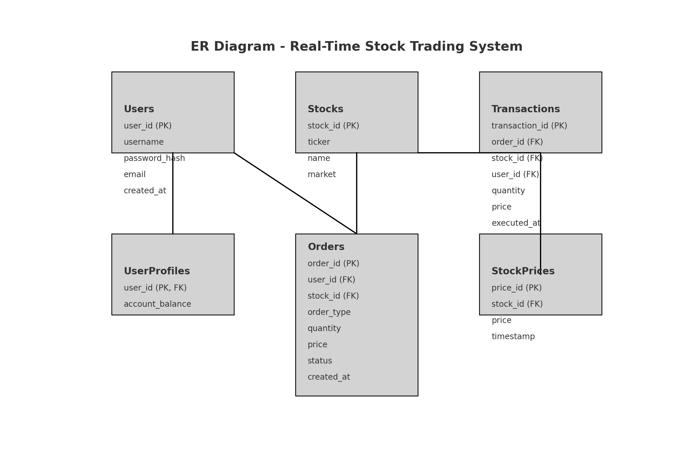

# Database Architecture

The Real-Time Stock Trading System is designed to manage users, stocks, orders, transactions, and stock prices. This document describes the database schema and the relationships between the tables.

## Tables

### 1. Users

The `Users` table stores information about the users of the trading system.

| Column      | Type          | Description                         |
|-------------|---------------|-------------------------------------|
| user_id     | INT           | Primary key, auto-incremented       |
| username    | VARCHAR(50)   | Unique username for the user        |
| password_hash | VARCHAR(255) | Hashed password                     |
| email       | VARCHAR(100)  | User's email address                |
| created_at  | TIMESTAMP     | Timestamp when the user was created |

### 2. UserProfiles

The `UserProfiles` table stores additional profile information for the users, including their account balance.

| Column          | Type          | Description                               |
|-----------------|---------------|-------------------------------------------|
| user_id         | INT           | Primary key, references `Users`(user_id)  |
| account_balance | DECIMAL(10, 2)| User's current account balance            |

### 3. Stocks

The `Stocks` table stores information about the stocks available for trading.

| Column      | Type          | Description                         |
|-------------|---------------|-------------------------------------|
| stock_id    | INT           | Primary key, auto-incremented       |
| ticker      | VARCHAR(10)   | Stock ticker symbol                 |
| name        | VARCHAR(100)  | Name of the company                 |
| market      | VARCHAR(10)   | Market where the stock is traded    |

### 4. Orders

The `Orders` table stores the orders placed by the users for buying or selling stocks.

| Column      | Type          | Description                         |
|-------------|---------------|-------------------------------------|
| order_id    | INT           | Primary key, auto-incremented       |
| user_id     | INT           | References `Users`(user_id)         |
| stock_id    | INT           | References `Stocks`(stock_id)       |
| order_type  | VARCHAR(4)    | Type of order ('BUY' or 'SELL')     |
| quantity    | INT           | Number of stocks ordered            |
| price       | DECIMAL(10, 2)| Price per stock                     |
| status      | VARCHAR(10)   | Order status ('PENDING', 'COMPLETED', 'FAILED') |
| created_at  | TIMESTAMP     | Timestamp when the order was placed |

### 5. Transactions

The `Transactions` table stores the executed transactions.

| Column          | Type          | Description                         |
|-----------------|---------------|-------------------------------------|
| transaction_id  | INT           | Primary key, auto-incremented       |
| order_id        | INT           | References `Orders`(order_id)       |
| stock_id        | INT           | References `Stocks`(stock_id)       |
| user_id         | INT           | References `Users`(user_id)         |
| quantity        | INT           | Number of stocks traded             |
| price           | DECIMAL(10, 2)| Price per stock                     |
| executed_at     | TIMESTAMP     | Timestamp when the transaction was executed |

### 6. StockPrices

The `StockPrices` table stores the historical prices of the stocks.

| Column      | Type          | Description                         |
|-------------|---------------|-------------------------------------|
| price_id    | INT           | Primary key, auto-incremented       |
| stock_id    | INT           | References `Stocks`(stock_id)       |
| price       | DECIMAL(10, 2)| Price of the stock                  |
| timestamp   | TIMESTAMP     | Timestamp when the price was recorded|

## Entity-Relationship Diagram

The following diagram illustrates the relationships between the tables in the database:

### Description

- **Users**: Each user can have one user profile and can place multiple orders.
- **UserProfiles**: Linked to `Users` by `user_id`, storing account balances.
- **Stocks**: Contains information about stocks available in the system.
- **Orders**: Each order is linked to a user and a stock. It stores information about the buy or sell orders.
- **Transactions**: Each transaction is linked to an order, stock, and user, storing the details of executed orders.
- **StockPrices**: Records the historical prices of stocks.

## Database Schema

Here is a summary of the database schema with primary and foreign key relationships:

- **Users** (`user_id` primary key)
- **UserProfiles** (`user_id` primary key, foreign key references `Users`(`user_id`))
- **Stocks** (`stock_id` primary key)
- **Orders** (`order_id` primary key, foreign keys reference `Users`(`user_id`), `Stocks`(`stock_id`))
- **Transactions** (`transaction_id` primary key, foreign keys reference `Orders`(`order_id`), `Stocks`(`stock_id`), `Users`(`user_id`))
- **StockPrices** (`price_id` primary key, foreign key references `Stocks`(`stock_id`))
- 
